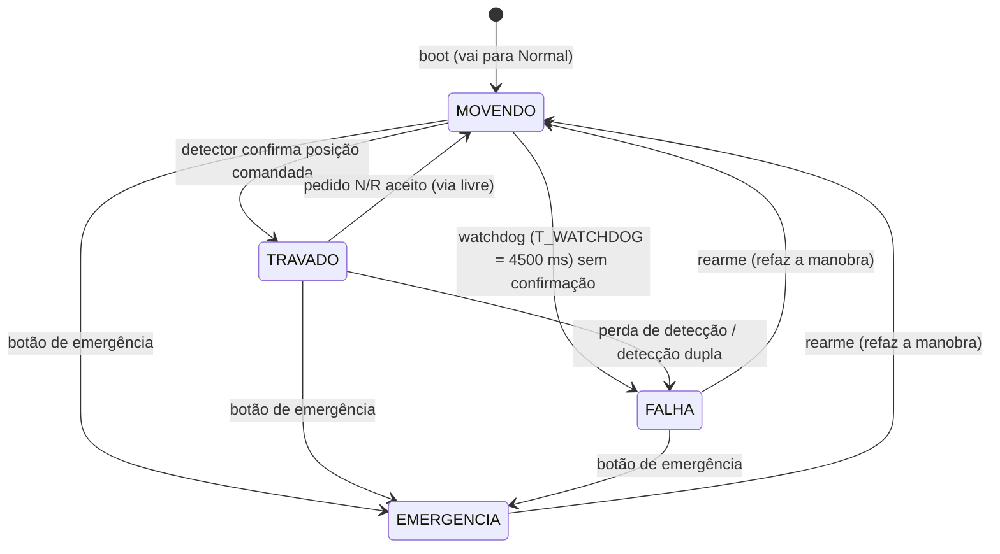
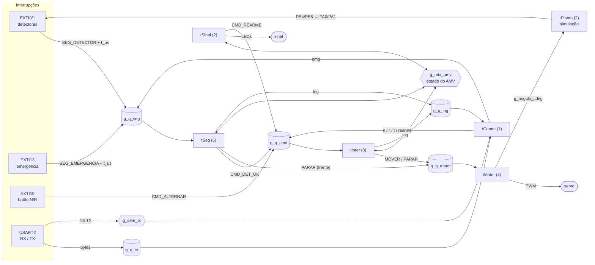
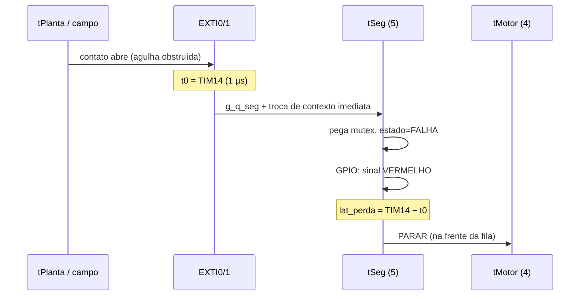

# Controle de AMV (desvio ferroviário) com FreeRTOS: arquitetura e tempos

Este documento descreve o firmware em `Core/Src/amv_*.c`. Ele serve de base
para os capítulos 3 (processo), 4 (desenvolvimento) e 5 (testes) do relatório.
Os valores "medidos" vêm do próprio firmware (comando `stats` na serial ou
tabela do painel web). Preencha-os depois de rodar a simulação.

---

## 1. O processo

**AMV** (Aparelho de Mudança de Via) é o desvio: um par de **agulhas** móveis
que direciona o trem para a via **normal** (reta) ou **reversa** (desviada). Em
metrôs e ferrovias ele é movido por uma **máquina de chave** elétrica e
supervisionado pelo **intertravamento**, o sistema que garante que nenhum
sinal libere uma rota incompatível com o estado real da via.

Pontos críticos do processo:

| Ponto crítico | Risco se falhar | Como o sistema trata |
|---|---|---|
| Agulha não encosta (pedra, gelo, desgaste) | descarrilamento na agulha | detector de fim de curso precisa confirmar em até `T_WATCHDOG`; senão, **falha** |
| Agulha abre com o trem liberado | descarrilamento | perda de detecção → sinal **vermelho** em microssegundos |
| Mover o AMV com trem em cima | descarrilamento / dano | com o circuito de via ocupado, o pedido fica **em espera** e só é executado quando o trem libera |
| Sinal abre antes do AMV travar | trem entra em rota errada | o sinal só sai do vermelho no estado `TRAVADO` e com detecção = comando |
| Emergência | colisão | botão leva tudo ao estado seguro, e só um **rearme** explícito volta |

**Regra de segurança central:** *sinal ≠ vermelho ⇔ estado = TRAVADO e
posição detectada = posição comandada*. Qualquer dúvida leva ao vermelho
(princípio **fail-safe**).

### 1.1 Modelo implementado (escopo)

O foco é a **manobra de um AMV** e a **supervisão da detecção**. A tabela
abaixo mostra o que cada componente real vira no simulador Wokwi.

| Elemento real | No simulador | Pino |
|---|---|---|
| Máquina de chave | servo (45° = Normal, 135° = Reversa) | PA6 (TIM3_CH1, PWM 50 Hz) |
| Detector de fim de curso N / R | contato gerado pela tarefa `tPlanta` → fio → entrada com interrupção | PB4→PA0, PB5→PA1 (EXTI0/1) |
| Circuito de via (ocupação) | chave deslizante (ou `occ 1` na serial) | PA4 |
| Obstrução da agulha (injeção de falha) | chave deslizante (ou `obs 1`) | PB1 |
| Sinal de proteção | LEDs vermelho / amarelo / verde | PB0 / PA7 / PB6 |
| Comando do CCO (centro de controle) | botão N/R ou serial (`n`, `r`, `t`) | PA10 (EXTI10) |
| Botão de emergência | botão vermelho (ou `emg`) | PC13 (EXTI13) |
| Rearme | botão amarelo (ou `rearme`) | PB3 (amostrado a 50 ms) |
| "CPU viva" | LD4 piscando a 1 Hz | PA5 |
| Trem | tarefa `tTrem` (simulação), desenhado no painel web | ocupa o circuito de via |

Aspecto do sinal: **verde** = travado em Normal (via direta), **amarelo** =
travado em Reversa (via desviada, velocidade reduzida), **vermelho** = qualquer
outro caso.

### 1.2 O trem simulado (`tTrem`, `amv_trem.c`)

Para exercitar o intertravamento com um trem de verdade circulando, a tarefa
`tTrem` simula um trem de 30 m num circuito fechado. Os comprimentos estão em
`amv.h` e batem com o desenho do painel.

```
 VOLTA (335 m) --[sinal, 40 m antes]--> AMV (16 m) --> Normal (86 m) ---+
   ^                                                \-> Reversa (97 m) --+
   +------------------------- junção de mola <----------------------------+
```

- **Velocidade**: definida pelo operador (`vel <km/h>`, 0 a 80; padrão 40).
- **Obedece o sinal com curva de frenagem** (como um ATP):
  v_perm = √(v_final² + 2·a·d), com a = 1,2 m/s² (serviço). No vermelho, para
  5 m antes do sinal. No amarelo, chega a 30 km/h e mantém esse limite até sair do ramal.
- **Frenagem de emergência** (2,5 m/s²): se o sinal fecha quando nem 110 % da
  frenagem de serviço é suficiente. Fica aplicada até o trem parar, e ele só volta
  a andar quando o sinal abrir. Se nem a emergência basta, o trem **passa o
  sinal vermelho** (evento `passou_vermelho`).
- **Circuito de via** (entra em `amv_hw_ocupado()`): ocupado do sinal até a
  cauda sair do AMV, e também antes do sinal quando o trem **já não consegue
  parar** nele (*travamento de aproximação*). Isso impede mover o AMV na frente
  de um trem comprometido.
- **Descarrilamento**: ao chegar no AMV, o trem segue a rota que os
  **detectores** indicam. Se a agulha não estiver encostada de nenhum lado
  (obstrução, manobra em curso), ele descarrila (evento `descarrilou`; o
  comando `trem` recoloca).

Distâncias de frenagem de serviço: 40 km/h → 51 m, 60 km/h → 116 m,
80 km/h → 206 m (cabe nos 290 m da volta; por isso o limite de 80 km/h).

---

## 2. Máquina de estados do intertravamento



**Confirmação da posição por dois caminhos:** a borda do detector chega
por interrupção (`tSeg` → `CMD_DET_OK`, caminho rápido) e, durante a manobra, o
`tInter` também lê o **nível** dos detectores a cada 50 ms
(`T_CONFIRMA_POLL_MS`). Se uma borda se perder, a manobra ainda trava, e o
evento mostra `travado ... confirmado=nivel` para isso ficar visível.

Quando o watchdog estoura, o evento de falha traz o diagnóstico de onde a
cadeia motor → planta → fio → pino parou:
`falha tipo=timeout apos_ms=4500 ang=13500 planta=R pinos=- obs=0`
(neste exemplo, o contato foi gerado em PB5 mas não chegou em PA1).

Um pedido é **rejeitado** quando o estado é `FALHA` ou `EMERGENCIA`
(bloqueado) ou quando o AMV já está (ou já está indo) para a posição pedida.

Quando o **circuito de via está ocupado** ou o AMV está **em movimento**, o
pedido não é descartado: fica **em espera** (*route stacking*, `ev pendente`).
O `tInter` reavalia a espera a cada volta do laço e, enquanto houver pedido
guardado, acorda a cada 50 ms (`T_PENDENTE_POLL_MS`). Assim que o AMV estiver
travado e o circuito livre, a manobra sai sozinha (`ev pedido origem=fila
espera_ms=…`). Vale o último pedido, e um pedido para a posição atual cancela a
espera. Falha ou emergência também cancelam (`ev pendente cancelado=falha`).

Isso importa porque, com o trem circulando, o circuito fica ocupado de 23 %
(20 km/h) a 68 % (80 km/h) do tempo (medido na simulação do `tTrem`). Sem a
fila, a maioria dos pedidos seria perdida.

---

## 3. Tarefas, prioridades e recursos do RTOS

### 3.1 Tarefas (7 da aplicação + idle)

| Tarefa | Prio | Ativação | Pilha (palavras) | Função |
|---|---|---|---|---|
| `tSeg` | 5 | evento: fila `g_q_seg` (vem de ISR) | 128 | emergência; supervisão dos detectores; confirma a manobra |
| `tMotor` | 4 | evento `g_q_motor` + periódica 20 ms | 112 | rampa da máquina de chave (0,6° a cada 20 ms) |
| `tInter` | 3 | evento `g_q_cmd` + timeout (watchdog) | 128 | máquina de estados do intertravamento |
| `tSinal` | 2 | periódica 50 ms | 96 | escreve o aspecto do sinal, lê ocupação, rearme, heartbeat |
| `tPlanta` | 2 | periódica 10 ms | 96 | **simulação** dos contatos dos detectores (não existe no campo) |
| `tTrem` | 2 | periódica 50 ms | 128 | **simulação** do trem no circuito: obedece o sinal, ocupa a via (seção 1.2) |
| `tComm` | 1 | evento `g_q_log` (e varre `g_q_rx` a cada 10 ms) | 256 | protocolo serial, telemetria (AMV a 250 ms, trem a 100 ms) |
| idle | 0 | (kernel) | 80 | roda quando nada mais está pronto |

As prioridades seguem a **criticidade**: quem leva ao estado seguro vem
primeiro (`tSeg`), depois quem tem prazo físico curto (`tMotor`, 20 ms), depois
a lógica de decisão e, por último, a interface.

### 3.2 Filas, mutex e semáforo

| Objeto | Tipo | Itens × tamanho | Quem escreve | Quem lê |
|---|---|---|---|---|
| `g_q_seg` | fila | 8 × 4 B | ISR EXTI (detectores, emergência), `tComm` (`emg`) | `tSeg` |
| `g_q_cmd` | fila | 8 × 4 B | ISR EXTI (botão N/R), `tComm`, `tSinal` (rearme), `tSeg` (`DET_OK`) | `tInter` |
| `g_q_motor` | fila | 4 × 4 B | `tInter` (MOVER), `tSeg`/`tInter` (PARAR, **na frente da fila**) | `tMotor` |
| `g_q_log` | fila | 12 × 12 B | `tSeg`, `tInter`, `tTrem` (sem bloquear) | `tComm` |
| `g_q_rx` | fila | 32 × 1 B | ISR USART2 (RX) | `tComm` |
| `g_mtx_amv` | **mutex** (herança de prioridade) | – | protege `g_amv`: `tSeg`, `tInter`, `tSinal`; leitura por `tComm` e `tTrem` | – |
| `g_sem_tx` | **semáforo binário** | – | ISR USART2 (fim da TX) dá | `tComm` espera |
| `g_stats` | seção crítica | – | `tSeg`, `tMotor`, `tInter` | `tComm` |
| `g_trem` | seção crítica | – | `tTrem` | `tComm` |

Alocação **100% estática** (`configSUPPORT_DYNAMIC_ALLOCATION = 0`). Não há
heap do RTOS, e o `.map` mostra exatamente o que cada objeto ocupa.

**Por que o `tSinal` escreve os LEDs segurando o mutex?** Sem isso poderia
acontecer: `tSinal` calcula "verde" → é preemptado → `tSeg` detecta falha e
acende vermelho → `tSinal` volta e escreve o verde calculado antes. Com o
mutex, o cálculo e a escrita são atômicos em relação ao `tSeg`. A herança de
prioridade limita o bloqueio do `tSeg` ao trecho curto do `tSinal`.

**Por que a serial não tem mutex?** Só o `tComm` transmite. As outras tarefas
mandam mensagens pela `g_q_log` com timeout 0, então **nunca esperam pela
serial**. Se a fila encher, perde-se um log, nunca um prazo.

### 3.3 Memória (medido no `.map`, build `-Og`)

| Item | Bytes |
|---|---|
| Pilhas das 7 tarefas (944 palavras) | 3 776 |
| Pilha da idle (80 palavras) | 320 |
| TCBs (8 × 80 B) | 640 |
| Controle das filas/mutex/semáforo (7 × 72 B) | 504 |
| Buffers das filas | 256 |
| **Total do RTOS** | **≈ 5,4 KB** de 12 KB |
| Firmware inteiro (`arm-none-eabi-size`) | text 28 216 B (de 32 KB), data 328 B, bss 7 952 B |

A pilha livre real de cada tarefa sai no comando `stats` (linha `stk`, em
palavras). Use esse valor para justificar o tamanho de cada pilha.

---

## 4. Fluxogramas

### 4.1 Visão geral (tarefas e mensagens)



### 4.2 Detalhe: manobra Normal → Reversa (diagrama de sequência)

```mermaid
sequenceDiagram
    autonumber
    participant CCO as Operador (serial/botão)
    participant INT as tInter (3)
    participant MOT as tMotor (4)
    participant PLA as tPlanta (2)
    participant ISR as EXTI0/1
    participant SEG as tSeg (5)
    participant SIN as tSinal (2)

    CCO->>INT: CMD_REVERSA (fila g_q_cmd, t_us)
    Note over INT: mutex: livre? parado? já em R?
    INT->>INT: estado=MOVENDO, sinal VERMELHO (GPIO)
    INT->>MOT: MOTOR_MOVER 135° (g_q_motor)
    Note over INT: mede lat_cmd; arma watchdog 4500 ms
    loop 150 × 20 ms (vTaskDelayUntil)
        MOT->>MOT: ângulo += 0,6°; PWM
    end
    Note over PLA: contato N abre na hora;<br/>contato R fecha após 100 ms estável
    PLA->>ISR: PB5 = 1 (fio → PA1)
    ISR->>SEG: SEG_DETECTOR (g_q_seg) + portYIELD_FROM_ISR
    SEG->>SEG: detectada=R == comandada
    SEG->>INT: CMD_DET_OK (g_q_cmd)
    INT->>INT: estado=TRAVADO; mede duração da manobra
    SIN->>SIN: (≤ 50 ms) aspecto = AMARELO
```

### 4.3 Detalhe: perda de detecção (caminho crítico de segurança)



---

## 5. Cálculos de tempo e garantias

Base: CPU a **48 MHz** (1 ciclo ≈ 20,8 ns), tick do FreeRTOS de **1 ms**,
Cortex-M0+ com 2 bits de prioridade de NVIC.

### 5.1 Metas (janelas de tempo)

| Caminho | Meta | Justificativa |
|---|---|---|
| Emergência → sinal vermelho | ≤ 10 ms | a 80 km/h (22,2 m/s) o trem anda 0,22 m em 10 ms: desprezível frente à distância de visibilidade do sinal |
| Perda de detecção → sinal vermelho | ≤ 10 ms | mesmo raciocínio: a restrição precisa ser "instantânea" na escala do trem |
| Pedido → motor comandado | ≤ 50 ms | operador não percebe; não é caminho de segurança |
| Manobra completa (motor → travado) | nominal 3 000 ms, limite 4 500 ms | máquinas de chave reais levam 3 a 6 s; o watchdog é 1,5 × o nominal |
| Período do motor | 20 ms ± 1 ms | é o período do PWM do servo; o passo precisa acompanhar |

### 5.2 Duração esperada da manobra

- Curso: 135° − 45° = 90° = 9 000 centésimos de grau.
- Passo: `ANG_PASSO = 9000 / (3000 ms / 20 ms) = 60` cdeg → **150 passos × 20 ms = 3 000 ms**.
- Fechamento do contato do detector: `T_CONTATO = 100 ms` + até 1 período da `tPlanta` (10 ms).
- ISR + `tSeg` + `tInter`: < 1 ms.
- **Esperado: ≈ 3 100 a 3 120 ms** (boot: de 90° a 45° = 75 passos, ≈ 1 600 ms).
- **Margem até o watchdog:** 4 500 − 3 120 ≈ 1 380 ms (≈ 44 %).

### 5.3 Latência do caminho de segurança (estimativa, pior caso)

| Parcela | Ciclos (estimado) | Tempo |
|---|---|---|
| Entrada na ISR (hardware M0+) | 16 | 0,3 µs |
| `HAL_GPIO_EXTI_IRQHandler` + callback + `xQueueSendFromISR` | ~400 | ~8 µs |
| Troca de contexto (PendSV) | ~150 | ~3 µs |
| `tSeg`: `xQueueReceive` + mutex livre + 3 escritas de GPIO | ~400 | ~8 µs |
| **Sem interferência** | | **≈ 20 µs** |
| Bloqueio pior caso: mutex com `tSinal` (herança de prioridade) | ~300 | ~6 µs |
| Outra ISR de mesma prioridade na frente (EXTI/USART) | ~400 | ~8 µs |
| Seção crítica mais longa do kernel | ~200 | ~4 µs |
| **Pior caso estimado** | | **≈ 40 µs ≪ 10 ms** |

O **motor para** no próximo passo do `tMotor`, ou seja, em até **20 ms**
(1 período). A segurança não depende disso: o sinal já está vermelho.

### 5.4 Utilização da CPU (análise de escalonabilidade)

| Tarefa | C (WCET estimado) | T (período / intervalo mínimo) | U = C/T |
|---|---|---|---|
| `tSeg` | 50 µs | 200 ms (debounce) | 0,03 % |
| `tMotor` | 60 µs | 20 ms | 0,30 % |
| `tInter` | 80 µs | 200 ms | 0,04 % |
| `tSinal` | 40 µs | 50 ms | 0,08 % |
| `tPlanta` | 30 µs | 10 ms | 0,30 % |
| `tTrem` (isqrt + mutex) | 60 µs | 50 ms | 0,12 % |
| `tComm` (status 250 ms + trem 100 ms, snprintf) | 1 ms | 100 ms | 1,0 % |
| **Total** | | | **≈ 1,9 %** |

O limite de Liu & Layland para 7 tarefas é n(2^(1/n) − 1) ≈ 72,8 %. Com
≈ 1,9 %, o conjunto é escalonável com muita folga.

Resposta do `tMotor` no pior caso: R = C_motor + C_seg + bloqueio(mutex, crítico) ≈
60 + 50 + 10 µs ≈ **0,12 ms ≪ 20 ms**. Por isso o jitter medido deve ficar
na ordem de dezenas de µs, dominado pela granularidade do tick.

### 5.5 Consequências de perder um prazo

| Prazo perdido | Consequência | Proteção |
|---|---|---|
| Detector não confirma em 4,5 s | AMV em posição indefinida | `FALHA_TIMEOUT` → sinal vermelho, motor parado, exige rearme |
| Perda de detecção não tratada | trem liberado sobre agulha aberta | `tSeg` na maior prioridade, caminho em µs, falha trava até rearme |
| Passo do motor atrasado | manobra mais lenta (não insegura) | watchdog cobre; jitter é medido |
| Log/telemetria atrasado | só a interface fica defasada | fila com timeout 0; `tComm` na menor prioridade |
| Estouro de pilha / assert | estado indefinido | `vApplicationStackOverflowHook` / `configASSERT` → `amv_hw_estado_seguro()` (vermelho, PWM desligado) |

---

## 6. Testes automáticos (lógica)

`make test` roda as tarefas reais sobre o FreeRTOS POSIX com hardware
simulado (ver README, seção 6). Resultado atual, que pode ir para o capítulo 5
como verificação funcional antes da medição no simulador:

| Cenário | Resultado | Manobras | Manobra (último/máx) |
|---|---|---|---|
| `manobras` (trem a 40 km/h) | ok | 7 | 3 100 / 3 109 ms |
| `trem80` (pedidos vindos da fila) | ok | 7 | 3 100 / 3 109 ms |
| `cliques` (espera/cancelamento) | ok | 5 | 3 100 / 3 109 ms |
| `emergencia` + rearme | ok | 4 | 3 100 / 3 108 ms |
| `fila` (ocupação) | ok | 2 | 3 108 ms |
| `obstrucao` (perda de detecção → timeout → rearme) | ok | 2 | – |
| `fio_quebrado` (diagnóstico) | ok | 1 | – |

A duração da manobra bate com o cálculo da seção 5.2 (≈ 3 100 a 3 120 ms).
As latências em µs medidas no PC não valem para a placa, porque ali o
"hardware" é um processo do Linux.

## 7. Como medir no simulador (capítulo 5 do relatório)

1. `./build.sh` → print da tela com o `arm-none-eabi-size` (tamanho do firmware).
2. No VS Code: F1 → `Wokwi: Start Simulator`. O painel conecta sozinho.
3. Roteiro de testes (o painel mostra último/máximo de cada medida):

| # | Ação | Esperado |
|---|---|---|
| 1 | boot | vai de 90° para Normal, trava em ≈ 1,6 s, sinal **verde** |
| 2 | `r` (ou botão N/R) | sinal vermelho na hora, manobra ≈ 3,1 s, trava, sinal **amarelo** |
| 3 | ligar "Ocupar via" e pedir `n` | `pendente alvo=N motivo=ocupado`, nada se move; ao desligar, a manobra sai sozinha |
| 4 | desligar ocupação, ligar "Obstruir agulha" com o AMV travado | `falha tipo=perda_det lat_us=…`, vermelho |
| 5 | com obstrução, `rearme` | refaz a manobra e, sem detecção, `falha tipo=timeout apos_ms≈4500` |
| 6 | tirar obstrução, `rearme` | trava de novo |
| 7 | `emg` no meio de uma manobra | vermelho, motor para, `emergencia lat_us=…` |
| 8 | `stats` | tabela de tempos + pilha livre de cada tarefa |
| 9 | `reiniciar` (botão "Reiniciar tudo") | reset por software (`NVIC_SystemReset`): tempo e medições zerados, repete o teste 1 |
| 10 | com o trem a 40 km/h, pedir `r` quando ele estiver longe do sinal | AMV manobra, sinal amarelo, trem entra no ramal a ≤ 30 km/h |
| 11 | pedir `n` com o trem entre a distância de frenagem e o AMV | `pendente motivo=ocupado` (aproximação travada); a manobra sai quando a cauda deixa o AMV |
| 12 | `vel 80` e `emg` com o trem a poucos metros do sinal | frenagem de emergência; se não der para parar, `trem evento=passou_vermelho` |
| 13 | `obs 1` com o trem se aproximando a 80 km/h | falha de detecção → vermelho → emergência; se a agulha ficar sem detecção sob o trem, `descarrilou` (`trem` recoloca) |

4. Compare os valores medidos com a seção 5. Um bom jeito de mostrar isso é
   uma tabela "calculado × medido" por caminho.
